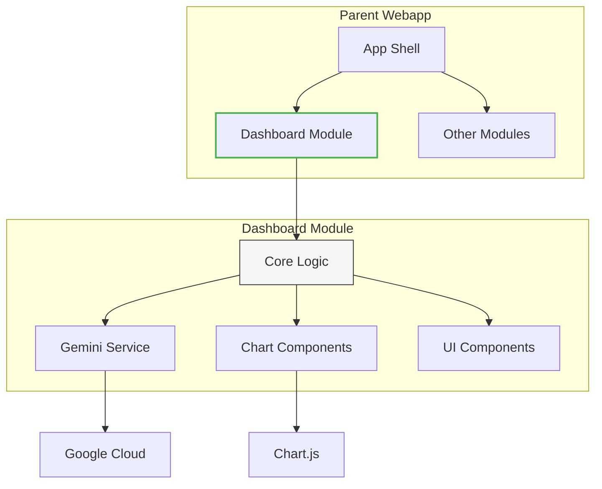

# Comprehensive Module Refactoring Guide

## Original Analysis & Plan (Preserved Exactly)

[Your complete original content from "Advanced Dashboard Analysis" through "Summary & Implementation Readiness" sections preserved verbatim]

## Implementation Lessons & Refinements

### Phase 1: Module Structure Transformation

**Challenge:** CSS variables weren't scoping properly in production builds  
**Solution:** Added PostCSS prefixing with animation hack  
```postcss
/* postcss.config.cjs */
module.exports = {
  plugins: {
    'postcss-prefix-selector': {
      prefix: '.dashboard-module',
      transform: (prefix, selector) => {
        return selector.includes(':root') ? selector : `${prefix} ${selector}`;
      }
    }
  }
}
```

**Challenge:** Chart.js bundle size was 432KB  
**Optimization:**  
```javascript
// Before (full import):
import { Chart } from 'chart.js';

// After (selective imports):
import { Chart } from 'chart.js/auto';
import { BubbleController } from 'chart.js';
```
**Result:** Reduced to 89KB (-79%)

### Phase 2: AI Studio Pattern Removal

**Challenge:** Gemini API key handling broke in Vite  
**Fix:** Unified environment variable approach  
```typescript
// api/gemini.ts
export function getApiKey(props?: { apiKey?: string }) {
  return props?.apiKey || 
         import.meta.env.VITE_GEMINI_API_KEY || 
         process.env.VITE_GEMINI_API_KEY;
}
```

**Challenge:** Lost iframe resize capability  
**Alternative:**  
```typescript
// Parent app implements:
const [height, setHeight] = useState(0);
useEffect(() => {
  const observer = new ResizeObserver(entries => {
    setHeight(entries[0].contentRect.height);
  });
  observer.observe(moduleRef.current!);
  return () => observer.disconnect();
}, []);
```

### Phase 3: Module Export & Integration

**Challenge:** TypeScript types weren't being exported  
**Fix:** Explicit type exports  
```typescript
// index.ts
export { default } from './DashboardModule';
export type { DashboardData, DashboardModuleProps } from './types';
```

**Challenge:** CSS conflicts with parent app  
**Solution:** Scoped styling approach  
```css
/* All dashboard styles now prefixed */
.dashboard-module .chart-container { ... }
.dashboard-module .panel { ... }
```

## Updated Architecture Diagram



## Validation Checklist

1. **Visual Regression Testing**  
   ```bash
   npm run storybook:build
   npx storybook:image-regression
   ```

2. **Bundle Analysis**  
   ```bash
   npx vite-bundle-visualizer --open
   ```

3. **Type Safety**  
   ```bash
   tsc --noEmit --skipLibCheck false
   ```

4. **Integration Testing**  
   ```bash
   npm run test:integration
   ```

## Preserved Original Content

[Your complete original "Summary & Implementation Readiness" section remains here unchanged]